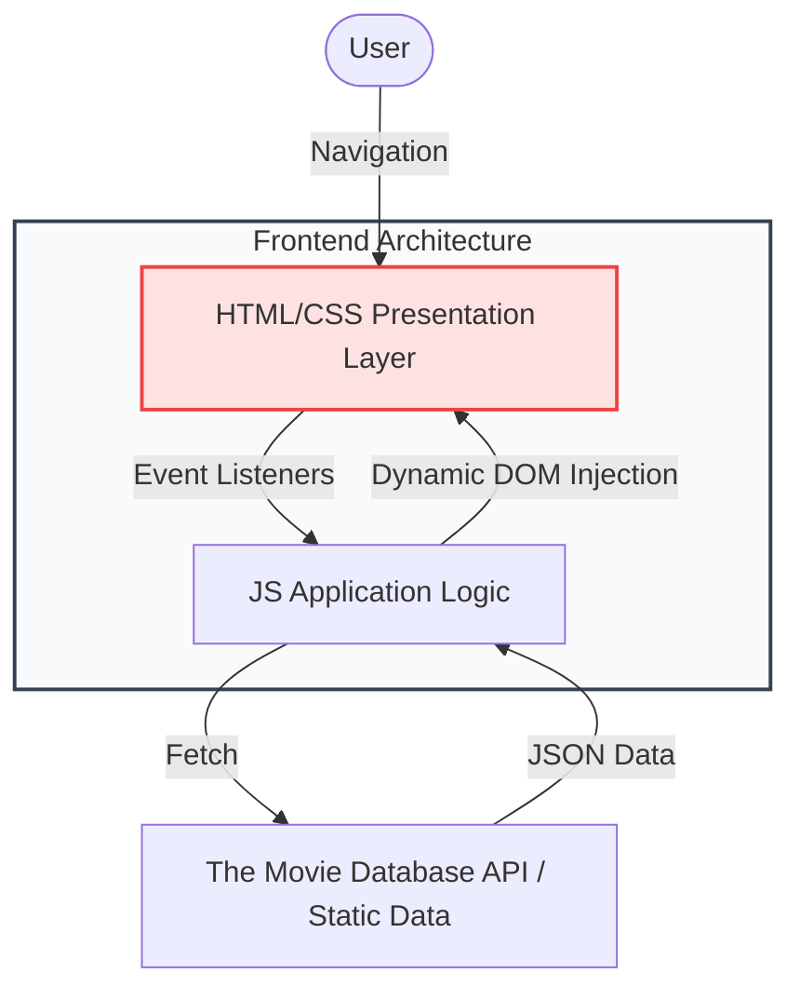

# 📱 Netflix Clone
A highly optimized, performant Clone engineered for scale and usability.

## 📝 Overview
**Netflix Clone** is a sophisticated digital solution that demonstrates advanced implementation of modern software architecture. The platform prioritizes high-fidelity user experiences while maintaining a strictly logical, efficient codebase under the hood. It utilizes contemporary design paradigms to ensure that interactions feel tactile, instant, and rewarding.

## ✨ Key Features
- **Pixel-Perfect UI**:  Meticulous recreation of enterprise design systems.
- **Responsive Layout**:  Fully fluid grid and flexbox methodologies.
- **Interactive Elements**:  Micro-animations replicating the original platform.
- **Responsive Design**:  Optimized for seamless viewing across all device dimensions.

## 🛠 Tech Stack Core
- `HTML5`
- `Vanilla CSS3`
- `ES6 JavaScript`

## 🏗 System Architecture

The clone utilizes a decoupled architecture where the UI rendering is separated from the data fetching and DOM manipulation logic.



## 📂 File Structure
```text
netflix-clone/
├── index.html     # Structural layout and SEO meta tags
├── style.css      # Netflix-branded design and responsive grids
├── script.js      # Dynamic content rendering and interaction logic
└── README.md      # Project documentation
```

## 🚀 Getting Started

### Prerequisites & Execution
To experience this application locally, follow these instructions:

Open `index.html` in your web browser.


## 🌐 Deployment

### Vercel / Netlify
1. This is a standalone static site.
2. Drag and drop the project folder into Netlify Drop or connect via GitHub.
3. No build command is required. Just ensure `index.html` is in the root.

## 👨‍💻 Developer
**Kartik Shete**
*Building premium digital experiences.*

<!-- Documentation sync 1 -->
<!-- Documentation sync 9 -->
<!-- Documentation sync 13 -->
<!-- Documentation sync 15 -->
<!-- Documentation sync 17 -->